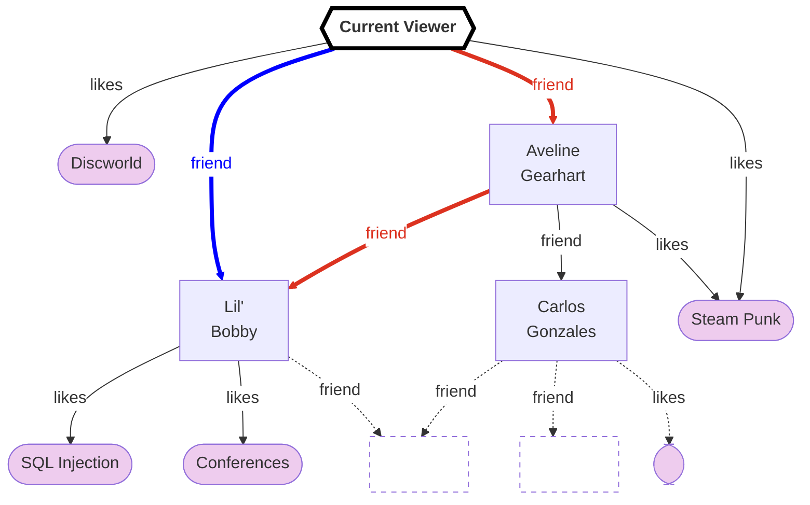

import { Tldr } from "@site/src/components/Tldr";
import { Pullquote } from "@site/src/components/Pullquote";
import "./ancestors.css";

# Referencing Ancestors

<Tldr>

GraphQL's execution model does not give you a native way to reference ancestors
in field resolvers (only the parent is provided), and that's for good reason:
to do so would break normalized caching. GraphQL mimics [traversing a
graph](#graph-traversal) and the value of a node in the graph is
independent of the path you took to get to it.

</Tldr>

One of the common requests that I see in GraphQL is users wanting a way to query
an ancestor object from a descendant object. Let's take a look at the example in
[GraphQL spec issue #144](https://github.com/graphql/graphql-spec/issues/144#issue-133595212);
here's the schema:

```graphql
type Query {
  events: [Event]
}

type Event {
  id: String
  name: String
  speakers: [Speaker]
  talks: [Talk]
}

type Speaker {
  id: String
  name: String
  events: [Event]
  talks: [Talk]
}

type Talk {
  name: String
  speaker: Speaker
  event: Event
}
```

Now consider this query:


```graphql
query {
  events {
    name
    speakers {
      name
      talks {
        name
      }
    }
  }
}
```

The issue author would like to make it such that `>events>speakers>talks`
(using [operation
expressions](https://github.com/graphql/graphql-wg/blob/main/rfcs/OperationExpressions.md)
format) returns the list of talks that the speaker has in the current event. At
first glance, this might seem like a reasonable ask... But as we think about
the rules in the GraphQL spec and how clients have come to rely on these rules,
we'll discover why this isn't so.

## Graph traversal

The 'Graph' in 'GraphQL' comes from, originally, Facebook thinking of their
data in terms of a graph:

<figure>


<figcaption>

&copy; Meta Platforms Inc; from the article [Under the Hood: Building out the
infrastructure for Graph
Search](https://engineering.fb.com/2013/03/06/core-infra/under-the-hood-building-out-the-infrastructure-for-graph-search/),
retrieved 2024-01-06T10:27:00Z.<br /><small>Used under the "Fair Use" doctrine (Copyright
Act, Section 107).</small>

</figcaption>

</figure>

In a graph you have "nodes" which are your entities (users, pages, posts,
photos, etc), and "edges" which are the relationships between these entities
(likes, tagged, photo, friend, etc). Both "nodes" and "edges" may contain data,
for example you might have that Bob is friends with Alice _since_ last
February.

When traversing a graph, you start at a node (or set of nodes) and then follow
the edges to discover new nodes. Let's imagine your name is 'Current Viewer'
and this is a portion of your graph:



To get to Lil' Bobby you could traverse `friend` directly (blue), or you could
traverse `friend>friend` to go via Aveline Gearhart (red). Note that
independent of which path you take to get to Lil' Bobby, their likes are always
the same: SQL Injection and Conferences.

This property turns out to be really important if you want to ensure the web
page is always rendered consistently even when only doing small data fetches.

## Rendering consistent data

It's extremely common in a web application for a change made in one place to
need to be reflected in other places in order to maintain consistency for the
viewer. For example, imagine you're viewing the posts on the profile page for
your friend Rebecca:

<!-- Thanks ChatGPT for building most of this for me -->
<div class="socialProfilePage">
<h1>Rebecca</h1>
<h3>Gotta get down on Friday!</h3>

    <!-- Post 2 -->
    <div class="post">
        <p class="author">Rebecca</p>
        <p>Heading to the studio now, just gotta grab a quick Starbucks first...</p>
        <p class="likes-comments">Likes: <span id="post2-likes">30</span> | Comments: <span id="post2-comments">12</span></p>

        <!-- Comments for Post 2 -->
        <div class="comments">
            <p class="comment"><span class="friend">Friend1:</span> Get their Pumpkin Spiced Latte!</p>
            <p class="comment"><span class="friend">Friend2:</span> Sing your heart out!</p>
            <p class="more">Show more…</p>
        </div>
    </div>

 <!-- Post 1 -->
    <div class="post">
        <p class="author">Rebecca</p>
        <p>The new album is coming along nicely!</p>
        <p class="likes-comments">Likes: <span id="post1-likes">42</span> | Comments: <span id="post1-comments">0</span></p>
    </div>

</div>

After you load the page, but before you click "Show more", Rebecca decides to
change her name to "Becky". You click "Show more" and new comments render,
including one from Becky. Seemingly magically, the entire page updates to
render "Becky" everywhere:

<div class="socialProfilePage">
<h1>Becky</h1>
<h3>Gotta get down on Friday!</h3>

    <!-- Post 2 -->
    <div class="post">
        <p class="author">Becky</p>
        <p>Heading to the studio now, just gotta grab a quick Starbucks first...</p>
        <p class="likes-comments">Likes: <span id="post2-likes">30</span> | Comments: <span id="post2-comments">18</span></p>

        <!-- Comments for Post 2 -->
        <div class="comments">
            <p class="comment"><span class="friend">Friend1:</span> Get their Pumpkin Spiced Latte!</p>
            <p class="comment"><span class="friend">Friend2:</span> Sing your heart out!</p>
            <p class="comment"><span class="author">Becky:</span> Pumpkin Spiced Latte FTW!</p>
            <p class="comment"><span class="friend">Friend2:</span> I prefer the Cinnamon one.</p>
            <p class="more">Show more…</p>
        </div>
    </div>

    <div class="post">
        <p class="author">Becky</p>
        <p>The new album is coming along nicely!</p>
        <p class="likes-comments">Likes: <span id="post1-likes">42</span> | Comments: <span id="post1-comments">0</span></p>
    </div>

</div>

Is this because we refetched all the data for the entire page? No! It's due to
the combined magics of object identification and normalized stores.

### Object identification

One of the common patterns you'll see in GraphQL schemas is the [GraphQL Global
Object Identification
Specification](https://relay.dev/graphql/objectidentification.htm). This
specification gives a standard way of identifying your entities (users, posts,
comments, etc) via an `id: ID!` field. Each entity that supports this may
declare so by its type implementing the `Node` interface. With this, we can
uniquely reference any entity of any type using a single, stable, unique
identifier. This pattern is used by the Relay GraphQL client among others.

This isn't the only way of identifying entities though; for example Apollo
Client lets you identify an entity via a combination of attributes using the
[`dataIdFromObject()`](https://www.apollographql.com/docs/react/caching/cache-configuration/#dataidfromobject)
callback (there are other options in newer versions of Apollo Client also).
This defaults to combining the `__typename` and `id` field of the object into a
unique identifier, which works assuming your entities have an `id` field, and
that you always fetch both the `id` and the `__typename`. Apollo Client will
automatically ask for `__typename` even if you forget, but it's up to you to
ask for `id`.

:::note

Some other GraphQL clients, such as URQL, also support normalized caching.
Please see your GraphQL client's documentation for how to enable such a feature
if it exists.

:::

When we fetch the profile for Rebecca we might find that the entity
representing her is the User with ID `U9DB7`. Later, when we fetch the
comments, we see the commenter 'Becky' has this same ID, and so we can
determine that Rebecca must have changed her name to Becky. But going through
and manually updating this everywhere that we've already fetched would be a lot
of work; what we need is a normalized store...

### Normalized store

A normalized store stores the entire information fetched across all of your
GraphQL requests (queries, mutations, subscriptions) in a format that means
that when an entity is updated in one place, it's automatically updated
everywhere.

Different normalized stores work in different ways, so I'm only going to give
an extremely rough approximation here. And to keep things simple, I'm going
to assume the store is configured (and the schema is written) such that `id`
is always a globally unique identifier.

Essentially because we know the globally unique identifier for the entities,
and we know that the value of a node in the graph is independent of the path
through which it was fetched, we can break a response up into its constituent
entities, store these and the references between them, and then reconstitute
the query response from this normalized store.

#### First query

For example, imagine our initial
profile fetch was:

```graphql
query ProfileFetch($id: ID!) {
  user(id: $id) {
    id
    name
    tagline
    posts(first: 2) {
      id
      author { id name }
      body
      likeCount
      commentCount
      comments(first: 2) {
        id
        author { id name }
        body
      }
    }
  }
}
```

The response to this query would be something like:

```json {3-4,10-11,38-39}
{
  "user": {
    "id": "U9DB7",
    "name": "Rebecca",
    "tagline": "Gotta get down on Friday",
    "posts": [
      {
        "id": "P3Q41",
        "author": { 
          "id": "U9DB7",
          "name": "Rebecca",
        }
        "body": "Heading to the studio now, just gotta grab a quick Starbucks first...",
        "likeCount": 30,
        "commentCount": 12,
        "comments": [
          {
            "id": "C2PL1",
            "author": {
              "id": "U6EA1",
              "name": "Friend1"
            },
            "body": "Get their Pumpkin Spiced Latte!"
          },
          {
            "id": "C3YZ3",
            "author": {
              "id": "U7BZ3",
              "name": "Friend2"
            },
            "body": "Sing your heart out!"
          }
        ]
      },
      {
        "id": "P3Q43",
        "author": { 
          "id": "U9DB7",
          "name": "Rebecca",
        }
        "body": "The new album is coming along nicely!",
        "likeCount": 42,
        "commentCount": 0,
        "comments": []
      }
    ]
  }
}
```

:::note

I've highlighted redundant data about the same entity (Rebecca)
referenced in multiple positions.

:::

We want to write this to our normalized store, wherein there's a single entry
for each entity in the result. We do this by reading through the results layer
by layer, and when we see an entity we extract it, store it, and replace the
original with a reference to the entity's id.

:::info

This is similar to "normalization" in databases: rather than storing repeated
author data in a `posts` table, we instead store the `author_id` into `posts`
and have a separate table for authors where you can look up the data for each
author by their unique `id`.

:::

Our very first entity is the root Query object itself; we can identify this
as simply `Query`:

```json5
{
  "Query": {
    /* ... */
  }
}
```

There's only one field in this, but critically that field
accepted arguments which would likely change the result of the field, so
we must factor the arguments into the identity of the field; thus rather
than `user` we might use `user(id:'U9DB7')`:

```json5 {4}
{
  "Query": {
    "user(id:'U9DB7')": {
      /* ... */
    }
  }
}
```

We can see from the data inside of this `user` field that it is an entity (it
has an `id`, the entity identifier), so we can replace it with a reference.
There are many ways of building a normalized store, but ours will leverage the
fact that a response key in GraphQL can never contain a `$` symbol and thus use
an object with a `$ref` key to indicate a reference.

```json5 {4,7}
{
  "Query": {
    "user(id:'U9DB7')": {
      "$ref": "U9DB7"
    }
  },
  "U9DB7": { /* ... */ }
}
```

:::danger Don't use this as a basis for your own normalized store

If you are actually looking to build your own normalized store, this isn't safe
since custom scalars such as `JSON` _are_ allowed to have `$ref` keys. If you
are writing your normalized store in JS then you could use a Symbol or a class
instance for references as examples of things that cannot be constructed from
JSON.

Another thing: since `id` is an arbitrary string the schema designer _could_
set the `id` of a `User` record to `Query` which would cause issues with the
design here. This is easy to solve by either prepending all identifiers (except
the root operation type identifiers you choose yourself) with a specific symbol
e.g. `@` or `$`.

:::

We can now write the value of the `user` with id `U9DB7` into our normalized store,
stopping when we reach another entity and extracting that:

```json {7-15}
{
  "Query": {
    "user(id:'U9DB7')": {
      "$ref": "U9DB7"
    }
  },
  "U9DB7": {
    "id": "U9DB7",
    "name": "Rebecca",
    "tagline": "Gotta get down on Friday",
    "posts(first:2)": [
      { "$ref": "P3Q41" },
      { "$ref": "P3Q43" },
    ]
  },
  "P3Q41": { /* ... */ },
  "P3Q43": { /* ... */ }
}
```

Continuing like this, our completed normalized store will end up something like:

```json
{
  "Query": {
    "user(id:'U9DB7')": {
      "$ref": "U9DB7"
    }
  },
  "U9DB7": {
    "id": "U9DB7",
    "name": "Rebecca",
    "tagline": "Gotta get down on Friday",
    "posts(first:2)": [
      { "$ref": "P3Q41" },
      { "$ref": "P3Q43" },
    ]
  },
  "P3Q41": {
    "id": "P3Q41",
    "author": { "$ref": "U9DB7" }
    "body": "Heading to the studio now, just gotta grab a quick Starbucks first...",
    "likeCount": 30,
    "commentCount": 12,
    "comments(first:2)": [
      { "$ref": "C2PL1" },
      { "$ref": "C3YZ3" }
    ]
  },
  "C2PL1": {
    "id": "C2PL1",
    "author": { "$ref": "U6EA1" },
    "body": "Get their Pumpkin Spiced Latte!"
  },
  "C3YZ3": {
    "id": "C3YZ3",
    "author": { "$ref": "U7BZ3" },
    "body": "Sing your heart out!"
  },
  "U6EA1": {
    "id": "U6EA1",
    "name": "Friend1"
  },
  "U7BZ3": {
    "id": "U7BZ3",
    "name": "Friend2"
  },
  "P3Q43": {
    "id": "P3Q43",
    "author": { "$ref": "U9DB7" }
    "body": "The new album is coming along nicely!",
    "likeCount": 42,
    "commentCount": 0,
    "comments(first:2)": []
  }
}
```

When you come to render this data in your application, you can regenerate the
query response from the normalized cache by walking through the GraphQL
document and extracting the specified entity for each field/arguments combo
referenced.

#### Second query

Now when we issue the request to load more comments, we might issue a request such as:

```graphql
query LoadMoreComments($postId: ID!, $offset: Int!) {
  post(id: $postId) {
    id
    comments(first: 2, offset: $offset) {
      id
      author { id name }
      body
    }
  }
}
```

using variables `{"postId": "P3Q41", "offset": 2}` and receive a response like:

```json {8-9}
{
  "post": {
    "id": "P3Q41",
    "comments": [
      {
        "id": "C4NR1",
        "author": {
          "id": "U9DB7",
          "name": "Becky",
        },
        "body": "Pumpkin Spiced Latte FTW!"
      },
      {
        "id": "C4NR6",
        "author": {
          "id": "U7BZ3",
          "name": "Friend2"
        },
        "body": "I prefer the Cinnamon one."
      }
    ]
  }
}
```

Note that the `name` has changed for the entity `U9DB7` (previously: Rebecca).

The normalized result for this query is:

```json
{
  "Query": {
    "post(id:'P3Q41')": {
      "$ref": "P3Q41"
    }
  },
  "P3Q41": {
    "id": "P3Q41",
    "comments(first:2,offset:2)": [
      { "$ref": "C4NR1" },
      { "$ref": "C4NR6" },
    ]
  },
  "C4NR1": {
    "id": "C4NR1",
    "author": { "$ref": "U9DB7" },
    "body": "Pumpkin Spiced Latte FTW!"
  },
  "C4NR6": {
    "id": "C4NR6",
    "author": { "$ref": "U7BZ3" },
    "body": "I prefer the Cinnamon one."
  },
  "U9DB7": {
    "id": "U9DB7",
    "name": "Becky",
  },
  "U7BZ3": {
    "id": "U7BZ3",
    "name": "Friend2"
  }
}
```

As we merge this into our main normalized store, we overwrite stale keys,
resulting in:


```diff {12-13}
 {
   "Query": {
     "user(id:'U9DB7')": {
       "$ref": "U9DB7"
+    },
+    "post(id:'P3Q41')": {
+      "$ref": "P3Q41"
     }
   },
   "U9DB7": {
     "id": "U9DB7",
-    "name": "Rebecca",
+    "name": "Becky",
     "tagline": "Gotta get down on Friday",
     "posts(first:2)": [
       { "$ref": "P3Q41" },
       { "$ref": "P3Q43" },
     ]
   },
   "P3Q41": {
     "id": "P3Q41",
     "author": { "$ref": "U9DB7" }
     "body": "Heading to the studio now, just gotta grab a quick Starbucks first...",
     "likeCount": 30,
     "commentCount": 12,
+    "comments(first:2,offset:2)": [
+      { "$ref": "C4NR1" },
+      { "$ref": "C4NR6" },
+    ],
     "comments(first:2)": [
       { "$ref": "C2PL1" },
       { "$ref": "C3YZ3" }
     ]
   },
   "C2PL1": {
     "id": "C2PL1",
     "author": { "$ref": "U6EA1" },
     "body": "Get their Pumpkin Spiced Latte!"
   },
   "C3YZ3": {
     "id": "C3YZ3",
     "author": { "$ref": "U7BZ3" },
     "body": "Sing your heart out!"
   },
+  "C4NR1": {
+    "id": "C4NR1",
+    "author": { "$ref": "U9DB7" },
+    "body": "Pumpkin Spiced Latte FTW!"
+  },
+  "C4NR6": {
+    "id": "C4NR6",
+    "author": { "$ref": "U7BZ3" },
+    "body": "I prefer the Cinnamon one."
+  },
   "U6EA1": {
     "id": "U6EA1",
     "name": "Friend1"
   },
   "U7BZ3": {
     "id": "U7BZ3",
     "name": "Friend2"
   },
   "P3Q43": {
     "id": "P3Q43",
     "author": { "$ref": "U9DB7" }
     "body": "The new album is coming along nicely!",
     "likeCount": 42,
     "commentCount": 0,
     "comments(first:2)": []
   }
 }
```

Now when the first query re-renders, it will re-read the normalized data from
the store and pick up Becky's new name, and render it everywhere, as we saw
above.

This is even more critical when performing mutations, where it's highly likely
that data the user is already viewing will be changed. We can even push it
further and add optimistic updates to our applications: we guess what the
server is going to say, write our guess to the normalized store, and instantly
re-render showing the user the new data everywhere in a consistent fashion.
Assuming everything went right, this is really nice for the user; but if
something goes wrong then we need to roll back this change and inform the user
of the error... so use it only in situations where the happy path is the likely
path!

Subscriptions also benefit from normalized caches; in fact you don't even need
to render your subscription results anywhere - if you subscribe to something
that you have fetched via a query, then when it changes the normalized store
will be updated, and the application will automatically re-render with the new
values. GraphQL real-time features can be fantastic when backed with a
normalized store!

