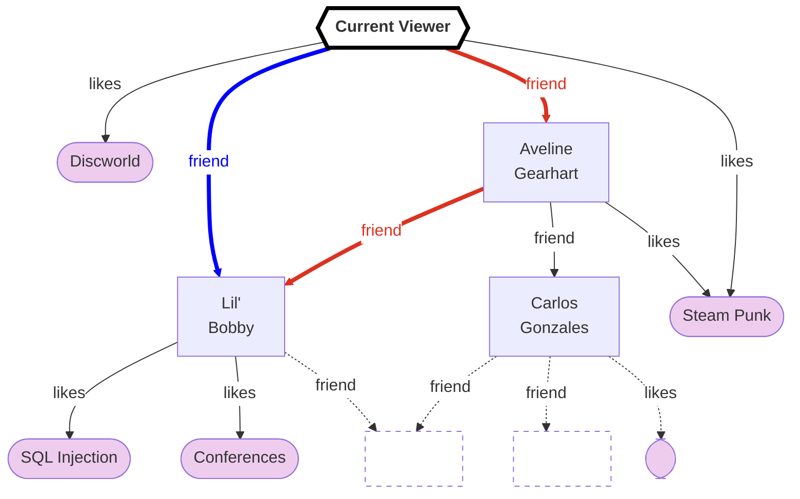

import { Tldr } from "@site/src/components/Tldr";
import { Pullquote } from "@site/src/components/Pullquote";

# Graph Traversal

<Tldr>

The 'Graph' in 'GraphQL' relates to traversing the graph of your data model. The
value of a node in a graph is independent of the path through which it was
fetched.

</Tldr>

The 'Graph' in 'GraphQL' comes from, originally, Facebook thinking of their data
in terms of a graph:

<figure>

<figcaption>

&copy; Meta Platforms Inc; from the article
[Under the Hood: Building out the infrastructure for Graph Search](https://engineering.fb.com/2013/03/06/core-infra/under-the-hood-building-out-the-infrastructure-for-graph-search/),
retrieved 2024-01-06T10:27:00Z. <small>Used under the "Fair Use" doctrine
(Copyright Act, Section 107).</small>

</figcaption>

</figure>

## Graph overview

In a mathematical graph, there are "nodes" and "edges". The nodes are generally
the entities (users, pages, posts, photos, etc), and the edges are the
relationships between those entities (likes, tagged, photo, friend, etc). Both
nodes and edges may contain data, for example, an edge might show that Bob is a
friend of Alice, and it can contain additional information such as the duration
of that friendship.

When traversing a mathematical graph, you can start at a node (or set of nodes)
and then follow the edges to discover new nodes. Let's imagine your name is
'Current Viewer' and this is a portion of your social graph:

To get to Lil' Bobby you could traverse `friend` directly (**blue**), or you could traverse `friend>friend` to
go via Aveline Gearhart (**red**). Note
that independent of which path you take to get to Lil' Bobby, their likes are
always the same: SQL Injection and Conferences.

This property turns out to be really important if you want to ensure the web
page is always rendered consistently even when only doing small data fetches by
using a storage technique we call [normalized stores](/graphql/normalized).
